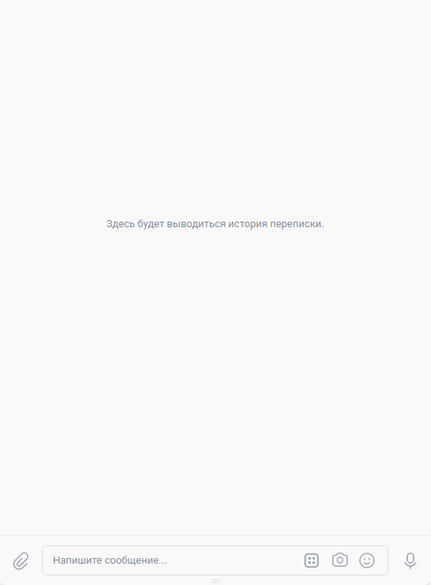

# Пример работы Telegram и VK ботов для проведения викторины.

Репозиторий содержит скрипты для запуска Telegram и VK ботов, а также скрипт для создания json-файла с вопросами и ответами.

Работа Telegram-бота:


Работа VK-бота:



Также можно протестировать работу ботов самому: 
  - [Telegram-бот](https://t.me/AgileMenuBot)
  - [группа VK](https://vk.com/public210058270)

## Запуск

- Скачайте код
- Настройте окружение. Для этого выполните следующие действия:
  - установите Python3.x;
  - создайте виртуальное окружение [virtualenv/venv](https://docs.python.org/3/library/venv.html) для изоляции проекта и активируйте его.
  - установите необходимые зависимости:

    ```
    pip install -r requirements.txt
    ```
- Создайте Telegram-бота и получите токен. Воспользуйтесь услугами [BotFather](https://telegram.me/BotFather), для этого необходимо ввести `/start` и следовать инструкции.
- Создайте группу [VK](https://vk.com/) и получите токен в настройках cообщений пункт `Работа с API`.
- В директории со скриптами создайте файл `.env`, в котором будут храниться чувствительные данные:
    ```
    TG_BOT_TOKEN='токен telegram-бота'
    VK_GROUP_TOKEN='токен VK-бота'
    DB_HOST='адрес хоста базы данных redis'
    DB_PORT='порт хоста базы данных redis'
    DB_PASSWORD='пароль хоста базы данных redis'
    QUIZ_QUESTIONS_DIRECTORY='директория с текстовыми файлами, содержащими вопросы и ответы с различных интеллектуальных игр (по умолчанию ./quiz-questions)'
    ```
- запустите VK-бота командой:
    ```
    python vk_bot.py
    ```
- запустите  Telegram-бота командой:
    ```
    python tg_bot.py
    ```
- Скрипт `create_quiz.py` предназначен для формирования json-файла с вопросами и ответами из исходных данных, находящихся в текстовых файлах в директории `quiz-questions` (по умолчанию):
    ```
    python create_quiz.py
    ```

## Деплой ботов на [Heroku](https://id.heroku.com/login)

- Разместите код в своем репозитории на GitHub.
- Зарегистрируйтесь на Heroku и создайте приложение во вкладке `Deploy`.
- Сохраните чувствительные данные во вкладке `Settings` в `Config Vars`.
- Добавьте стандартный python-buildpack.
- Выберите ветку `main` нажмите `Deploy Branch` во вкладке `Deploy`.
- Активируйте процессы на вкладке `Resources`.
Для просмотра в консоли возможных ошибок при деплое используйте [Heroku CLI](https://devcenter.heroku.com/articles/heroku-cli#download-and-install).

## Цели проекта
Код написан в учебных целях — это урок в курсе по Python и веб-разработке на сайте [Devman](https://dvmn.org).